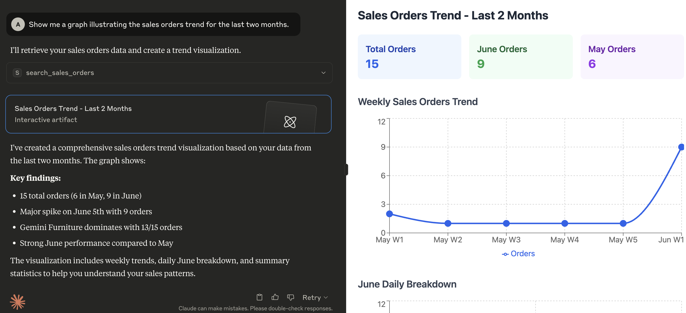

# mcp-server-odoo

An extensible [Model Context Protocol](https://modelcontextprotocol.io) server that provides integration between [Odoo](https://www.odoo.com) and LLMs.

**Beware: the project is in very early development. Expect rough edges. We welcome any feedback!**

## MCP server in action

Here's a demonstration of what kind of capabilities the MCP enables in [Claude for Desktop](https://claude.ai/download):



## Prerequisites

- [uv](https://docs.astral.sh/uv/getting-started/installation/)

## Configuration

The server looks for the following variables in the execution environment:

| Variable | Required | Description | Example |
|----------|----------|-------------|---------|
| `ODOO_BASE_URL` | Yes | The URL of the Odoo instance | `http://localhost:8069` |
| `ODOO_DATABASE` | Yes | The database name to connect to | `mydatabase` |
| `ODOO_USERNAME` | Yes | Username for authentication | `admin` |
| `ODOO_PASSWORD` | Yes | Password or API Key for authentication | `admin` |
| `ODOO_VERSION` | Yes | Major version of your Odoo server | `18` |
| `LOG_LEVEL` | No | Desided logging level (see [Python logging levels](https://docs.python.org/3/library/logging.html#logging-levels)), default is INFO | `INFO` |
| `TRANSPORT_PROTOCOL` | Yes | The [MCP transport protocol](https://modelcontextprotocol.io/docs/concepts/transports) to use. Valid values are `stdio` for local-only communication or `sse` / `streamable-http` for remote communication | `stdio` |
| `HOST` | No | The IP address(es) on which the server is to listen for connections from clients | `127.0.0.1` |
| `TOOLS_TO_REGISTER` | Yes | Comma-separated list of tools to expose to the MCP client. Tools can be chosen from those included within this project (see directory `src/mcp_server_odoo/tools`), or custom ones provided by external files (see `EXT_DIRECTORIES`) | `search_partners,search_quotations,search_sales_orders,search_customer_invoices` |
| `EXT_DIRECTORIES` | No | Comma-separated list of paths to search for additional tools that can be loaded at runtime | `/your/custom/path` |

## Installation

Install the tool with `uv tool`:

```sh
uv tool install --from git+https://github.com/alberto-re/mcp-server-odoo mcp-server-odoo
```

## Run the server

Execute it directly with `uvx`:

```sh
uvx mcp-server-odoo
```

## Run within Docker

A `Dockerfile` is included if you wish to run the MCP server inside a Docker container.

To build the container execute this command from the root directory of the repository:

```sh
docker build -t mcp-server-odoo .
```

Now you can execute the container from the built image with:

```sh
docker run --rm --env-file /path/to/env/file -p 8000:8000 mcp-server-odoo
```

When running inside a container remember to use an HTTP based transport protocol (i.e. set `TRANSPORT_PROTOCOL` to `sse` or `streamable-http`)
and to make the server listen to all interfaces (i.e. set `HOST` to `0.0.0.0`).

## Integrations

### Connecting to Claude Desktop

1. Edit the [Claude for Desktop](https://claude.ai/download) configuration file.
  - In MacOS the configuration is located at `~/Library/Application Support/Claude/claude_desktop_config.json`.
  - In Windows the configuration is located at `%APPDATA%\Claude\claude_desktop_config.json`

2. Add the server configuration under the mcpServers section.

```json
{
  "mcpServers": {
    "mcp-server-odoo": {
      "command": "uvx",
      "args": [
        "mcp-server-odoo"
      ],
      "env": {
        "ODOO_BASE_URL": "http://localhost:8069",
        "ODOO_DATABASE": "mydatabase",
        "ODOO_USERNAME": "admin",
        "ODOO_PASSWORD": "admin",
        "ODOO_VERSION": "18",
        "TRANSPORT_PROTOCOL": "stdio",
        "TOOLS_TO_REGISTER": "search_partners,search_quotations,search_sales_orders,search_customer_invoices"
      }
    }
  }
}
```

3. Restart Claude for Desktop.

### Connecting to mcphost

1. Edit the [mcphost](https://github.com/mark3labs/mcphost) configuration file. See the [documentation](https://github.com/mark3labs/mcphost?tab=readme-ov-file#mcp-server) for where it looks for configuration files.

2. Add the server configuration under the mcpServers section.

```json
{
  "mcpServers": {
    "mcp-server-odoo": {
      "command": "uvx",
      "args": [
        "mcp-server-odoo"
      ],
      "env": {
        "ODOO_BASE_URL": "http://localhost:8069",
        "ODOO_DATABASE": "mydatabase",
        "ODOO_USERNAME": "admin",
        "ODOO_PASSWORD": "admin",
        "ODOO_VERSION": "18",
        "TRANSPORT_PROTOCOL": "stdio",
        "TOOLS_TO_REGISTER": "search_partners,search_quotations,search_sales_orders,search_customer_invoices"
      }
    }
  }
}
```

3. Execute the `mcphost` command.
